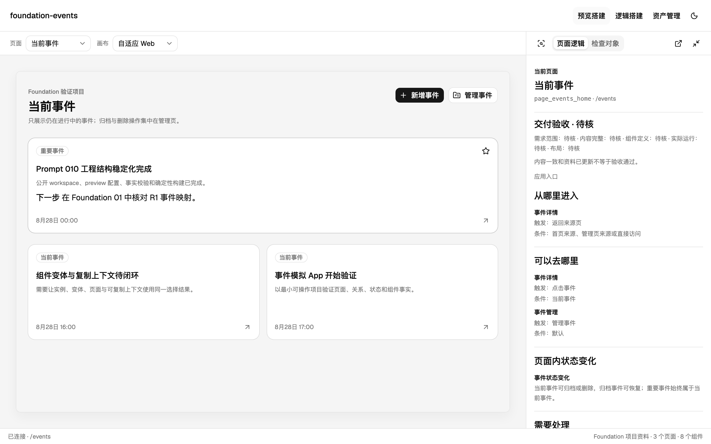

# Foundation

让用 AI 做产品的人，说清页面结构、对象关系和准确修改位置。

Foundation 是一个本地工作台：把项目已记录的页面、组件、关系、交互与资产放在一起，帮助你告诉 AI「要改哪一处」，并查看已知影响。它不会自动理解所有代码，也不会替你决定修改范围。



*真实工作台截图，使用仓库内的 foundation-events 隔离示例；不是用户项目，也不是概念图。*

## 你是不是也遇到这些问题

| 遇到的情况 | Foundation 当前能提供什么 | 边界 |
|---|---|---|
| 页面结构越来越复杂，找不到要改的那一块 | 在已接入的预览中检查对象，看到所在页面、稳定身份、完整层级，以及它是已登记组件还是普通局部结构 | 不会自动理解任意应用或未接入的网站；没有返回或登记的事实仍是未知 |
| 不清楚页面如何跳转、什么会触发状态变化 | 查看已登记的页面关系、进入与去向、触发条件、目标状态及验证状态 | 关系登记与运行时绑定是两件事；不会声称发现了全部业务逻辑 |
| 只能对 AI 说“左边那块”，反复解释仍改错 | 从选中对象复制“身份与层级”“相关逻辑”“布局与样式”或“使用、影响与缺口”，再补上具体修改目标 | 生成的是更具体的任务上下文，不保证 AI 一定理解正确或自动完成修改 |
| 一个组件用在多处，不知道改了会影响哪里 | 查看已登记组件或资产的已知使用页面、实例和相关变更，并区分修改组件资产还是当前实例 | 已知使用位置不是全部传递依赖的证明，仍需结合代码与验证复核 |
| 换一次对话就丢掉项目背景 | 把页面、组件、关系、交互、资产和变更等长期事实保存在项目自己的 `.foundation/facts/` | facts 不会凭空保持完整或永远最新；缺失、待确认和冲突会继续显示为缺口 |


## 用 Codex 安装

在一个**不属于源码建设目录、允许写入安装位置的新 Codex 对话**里粘贴以下命令。npm 0.1.3 与配套运行版 0.2.8 已发布并完成发行字节核验；新对话安装体验仍待真人验收：

```text
npx --yes --package @josephyulei/summon-foundation@0.1.3 summon foundation
```

当前支持 **macOS Apple Silicon（arm64）**，获取入口需要 **Node.js 22.9+ 与 npm**，以及可用网络、本地命令和浏览器工具。不需要 clone 项目，也不需要自己下载、解包或填写校验参数。缺少依赖或写入权限时先解决前置条件，不会自动全局安装工具。

当前运行版为 [v0.2.8](https://github.com/y15801172513-lang/foundation/releases/tag/v0.2.8)。新版入口会实际下载并准备目录选择页，不再只打印接续提示；但无历史新 Codex 对话是否正确打开页面、持续等待并主动告知结果，仍须真人验收。默认使用 Codex 内置浏览器，系统浏览器仅在告知并同意后备用。当前版本与过渡方法见[安装说明](docs/install-with-codex.md)。

### 接下来会发生什么

1. 检查环境和正式发行，说明下载缓存及其他写入位置。
2. 自动下载并校验运行文件；此时只准备材料，还没有安装。
3. 在安装页选择文件夹（建议位置可以修改），随后查看绑定版本、最终目录和影响范围的计划；不默认使用源码目录，也不覆盖未知已有内容。
4. 你亲自确认或取消。仅打开页面、在对话说「好」或关闭浏览器，都不代表安装批准。
5. 安装后核验版本与状态，说明装了什么、在哪里、什么没做，以及下一步。

安装程序使用随包运行时；安装后重开不再依赖系统 Node/npm。页面可以独立展示结果；对话结束后，网页不会自动唤醒它。详情见[安装与结果恢复说明](docs/install-with-codex.md)。

## 开始使用

安装成功后，可继续让当前安装对话打开 Foundation。只有一个工作台；安装、更新、卸载页只是临时确认与结果页。

若希望新对话能识别「打开 Foundation」或「给我 foundation 指令 list」，需要**另行确认启用 Foundation 对话能力（Skill）**。未注册时不能承诺新对话自动发现。完整指令只在对话显示，见[对话指令说明](docs/conversation-commands.md)。

再选择一个你想接入的项目。Foundation 会先检查已有信息、展示独立计划，等你确认后才接入；不自动扫描或启用其他项目。没有接入项目时显示空状态，不拿示例冒充你的数据。

一个典型用法：在接入的预览中选中对象，复制其身份、层级及已知关联，再告诉 AI「只调整当前实例，不修改共享组件」。这些信息帮助把任务说具体，实际修改仍须核对代码和结果。页面关系与使用位置只涵盖已登记的信息，不代表完整依赖分析。

## 更新、卸载与数据

- **手动更新**：先检查当前安装，再准备目标版本和独立确认计划；新版发布不等于本机已更新。
- **失败恢复**：保留真实错误和恢复材料，不重复执行旧批准；先核验结果再继续。
- **普通卸载**：只处理明确属于 Foundation 的内容，保留项目源码、项目事实和未获准删除的文件，不清空整个文件夹。
- **下载缓存**：不会凭“安装成功”自动全部删除。升级暂存清理有明确条件；卸载后的回执和[独立清理说明](docs/cache-cleanup.md)仍可读取。

## 当前边界

本地文件 `.foundation/facts/` 保存项目已登记的长期事实；缺失、冲突和待确认的信息仍须补充。Foundation 不保证 AI 自动改对，也不会因安装而接入项目或注册 Skill。

运行文件来自正式版本化 GitHub Release，经过来源证明和字节校验；这不等于 Apple 签名或公证。当前没有 Developer ID 签名/公证，不关闭 Gatekeeper、不移除隔离属性来绕过安全检查。暂不支持 Windows、自动更新或任意未接入网站。

## 进一步了解

- [入门指南](docs/getting-started.md)：示例体验和源码开发预览。
- [安装说明](docs/install-with-codex.md)：环境、获取、确认、重开和独立 Skill 接入。
- [当前状态](docs/current-status.md) · [验证基线](docs/verification-baseline.md)：版本对应、工程证据与尚待真人验收的事项。
- [数据契约](docs/data-contract.md) · [架构与安全](docs/architecture.md) · [CLI 参考](docs/cli-reference.md)：详细实现与开发说明。

公开代码采用 [MIT 许可证](https://github.com/y15801172513-lang/foundation/blob/main/LICENSE)，第三方许可证与声明见[第三方声明](THIRD_PARTY_NOTICES.md)。公共仓库只包含审核后的公开内容；私有开发历史不公开。
